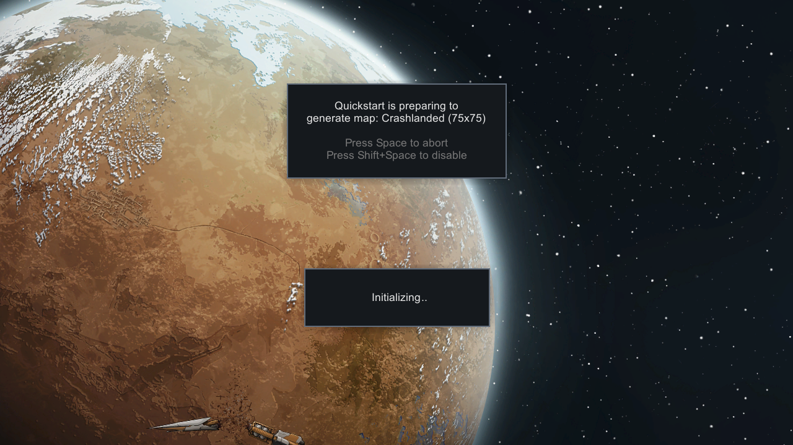
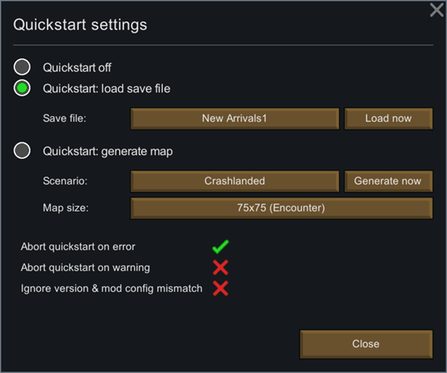

  
&emsp;
  
&emsp;
  
&emsp;
  

  
&emsp;
  

_Quickstarter: Load a save file or generate a new map with a given scenario and size right after the game is started. Also allows to generate a new map with one click. Settings dialog included._ — [Unlimited Hugs](https://github.com/UnlimitedHugs/RimworldHugsLib)

# Description

This mod is primarily for other modders. It expands on RimWorld's built-in `quicktest` feature by allowing you to boot the game directly into a map of your chosen size using the scenario of your choice.

You also have the option of, instead of generating a new map at startup, instead loading into the save file of your choice, or just telling it to load the most recent save.

Quickstart was originally part of the venerable [HugsLib](https://steamcommunity.com/workshop/filedetails/?id=818773962) library. HugsLib, however, does a number of not-really-related things, and it hasn't been updated in quite a long time. So I decided to break out the Quickstart feature (which I use _excessively_ when I'm modding) into its own independent mod that could be installed by itself, without the need to load all of HugsLib into your game.

# Compatibility

This mod can coexist in your mod list alongside original-recipe Hugslib. This mod checks at initialization to see if Hugslib is active; if it is, this mod just doesn't do anything at all. So while you _can_ run both mods at the same time, there's no good reason to. If you're running Hugslib, you don't need this mod.

HugsLib Quickstart goes great with [Log Publisher from HugsLib](https://steamcommunity.com/sharedfiles/filedetails/?id=2873415404).

# Acknowledgments

Most of the code in this mod is lifted directly from the [HugsLib GitHub repository](https://github.com/UnlimitedHugs/RimworldHugsLib), the contents of which were generously [put into the public domain](https://github.com/UnlimitedHugs/RimworldHugsLib/blob/master/license.txt).

Portions of the materials used to create this mod are trademarks and/or copyrighted works of Ludeon Studios Inc. All rights reserved by Ludeon. This content/mod is not official and is not endorsed by Ludeon.
